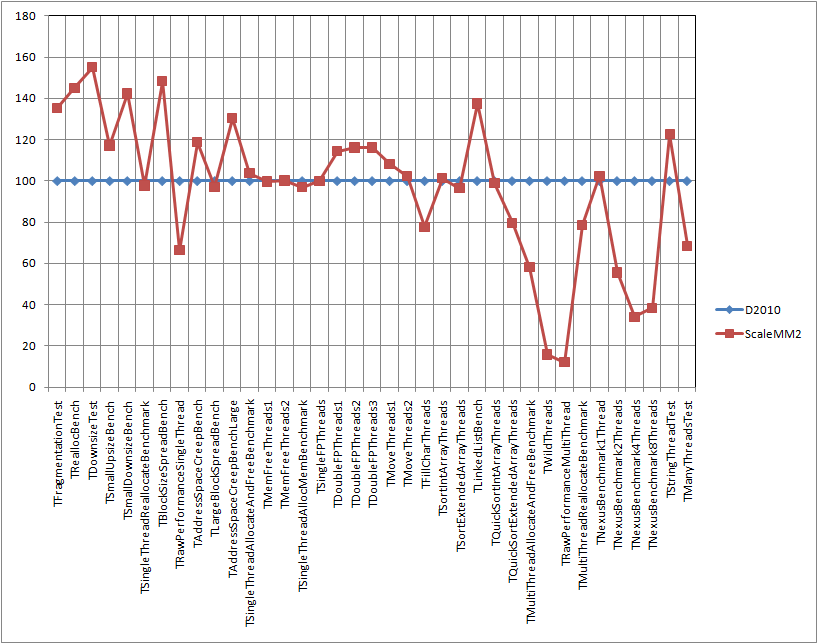

# ScaleMM

ScaleMM is faster and scales a lot better than FastMM in multithreaded scenarios.

I started with this project by making proof-of-concept to see if I could make a simple and very small and compact MM, which is not as bloated (or difficult to understand) as FastMM. And of course it must scale on multi core CPU's.
I failed on the first goal (ScaleMM2 is not easy to understand, because MM's are not easy!) but succeeded on the latter.

[Please donate :)](https://www.paypal.com/cgi-bin/webscr?cmd=_donations&business=andre%2emussche%40gmail%2ecom&lc=US&item_name=ScaleMM&item_number=ScaleMM&currency_code=EUR&bn=PP%2dDonationsBF%3abtn_donateCC_LG%2egif%3aNonHosted)

# Release version 2 is stable

The v2 version is stable now, but not perfect:
* 18-12-2013: [Version 2.4.1](https://scalemm.googlecode.com/files/ScaleMM_v2_4_1.zip) released: lots of interthread memory fixes + SSE3 move included
* Todo:
  * does not check and report memory leaks
  * more optimizations + code cleanup needed

_Note: do not use v1 or v3!_

If anybody can optimize it further: please help! :-)

# Benchmarks

* [Simple Benchmark](SimpleChallenge/results.txt) from [SimpleChallenge](SimpleChallenge)
  ScaleMM2 is the fastest, but TCmalloc performs good too (but does not release memory to Windows?). MSVCRT of  Windows 7 is not bad. JeMalloc and Hoard are disappointing.
  
* [Extended Benchmark](Challenge/Results/MMBench_all.htm) from [Challenge](Challenge)
* FastCode MM Benchmark with D2010 verses ScaleMM 2.03
  
_Note: Lower is better for ScaleMM: D2010 is 100% duration time, so if ScaleMM has a higher % it is slower._
* ScaleMM1 Benchmark
  Demo test (# of thread with alloc + realloc + free) on a quad core PC (Win7).
  Result is average milliseconds per thread:
  ScaleMM1:
  1=1161, 2=1161, 3=1151, 4=1180, 6=1547, 8=2068, 16=4248
  D2010:
  1=4314 2=8081, 3=11724, 4=14682
  TopMM:
  1=3439 2=3532, 3=3526, 4=3673, 6=4746, 8=7222, 16=12622
  
  As you can see, TopMM and ScaleMM1 have a horizontal line till 4 threads, so it scales perfectly because we have 4 cores!
  _Note: benchmark done with initial ScaleMM1, it must be updated with the newest ScaleMM2 version!_

# Programming considerations

I had the following coding priorities:
  * scalability
  * speed
  * speed
  * speed
  * low memory overhead
  * readable code

Some code parts are not nicely coded or logical ordered, but some randomizations gave better results (see optimizations below)   

# Optimizations

Optimized with [Intel VTune](http://software.intel.com/en-us/intel-vtune/) and some "trial and error" changes to see which approach gives fastest result. Current speed is the fastest I could get with Delphi code right now, more speed can be gained through pure assembly optimizations.

I tried to apply the following optimizations:
  * locality (data close to each other, for example: fixed array of record instead of pointers, to reduce L1 en L2 cache misses)
  * reduce branch misprediction (main path in "if statement" + 'inline' functions, other stuff in "else part" with 'call' functions
  * compact code (so main path fits in instruction cache)
  * inline functions (less jumps by cpu)
  * break register dependency, so independent parts can be executed parallel by CPU

I did not check the alignment, but adding some fillers only gives speed decrease so I assume it is the best the way it is now.

# Internal working

Short description how it works:
  * It scales good because every thread has its own memory (Delphi threadvar aka TLS (thread local storage))
  * It is fast because it does no scanning:
    * Calculate which block list to use.
      It has 2 fixed arrays of block lists, each block list contains blocks with fixed  number of a fixed item size, e.g. 50 items of 32 bytes.
      It has mini blocks (32-256 bytes, with 32 byte step size) and small blocks (256-2048  bytes, 256 byte step size). Larger blocks are not handled yet.
      Calculation is simple: “requested memory size” div “item size”. For example:  
      * 16 div 32 = 0 -> it fits in a 32 byte block, first block list of “mini” array
      * 40 div 32 = 1 -> 64 byte block, second block list
      * 500 div 256 = 1 -> 512 byte block, second block list of “small” array
    * Block list has pointer to first block with freed memory items.
      Memory reuse is efficient because we have 50 items in a block, so it is more common to have a freed item: a new item is only allocated once, and reused many times after that.
      Blocks are double linked to each other, so when one block is full, we can get fast and easily the next block. Also a block can be removed easily by linking the previous block to the next block (dynamic arrays are slower with adding (resizing) and removing (shifting items)).
    * Get last item of fixed array: dec(ItemIndex)
      A fixed array of 50 items is faster than a linked list
